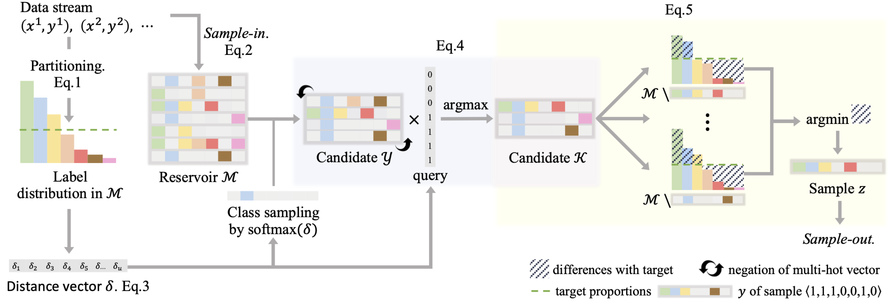

# \[PRS\] Partitioning Reservoir Sampling

# 


## System Dependencies
- Python >= 3.6.1
- CUDA >= 9.0 supported GPU with at least 4GB memory

## Installation
Using virtual env is recommended.
```
$ conda create --name continual_multilabel python=3.6
```
Install pytorch==1.5.0 and torchvision==0.6.0.
Then, install the rest of the requirements.
```
$ pip install -r requirements.txt
```

## Data and Log directory set-up
create `checkpoints` and `data` directories.
We recommend symbolic links as below. Note the `Destination Paths` are decided during the dataset creation [here](../dataset).
```
$ mkdir data
$ ln -s [MSCOCO Destination Path] data/MSCOCO
$ ln -s [NUS-WIDE Destination Path] data/NUS-WIDE
```

## Run
Specify parameters in `config` yaml, `episodes` yaml and `episode` yaml files.
```
python main.py --log-dir [log directory path] --c [config file path] --e [episode file path]

# to run our COCOseq experiments
python main.py --log-dir [log_dir_path] --c configs/mlab_prs-coco.yaml --e episodes/coco-split_0312.yaml --override "data_root=[data_path]";

# to run our NUS-WIDEseq experiments
python main.py --log-dir [log_dir_path] --c configs/mlab_prs-nw.yaml --e episodes/nw-split_310542.yaml --override "data_root=[data_path]";
```

Last edit: July 10, 2020
