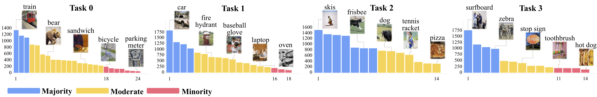

# COCOseq & NUS-WIDEseq dataset

# 

## System Dependencies
- Python >= 3.6.1

## Installation
Using virtual env is recommended.
```
$ conda create --name PRS python=3.6
$ conda activate PRS
$ pip install -r requirements.txt
```

## Data Preparation
#### 1. COCOseq
- Please download the COCO 2014 [train images](http://images.cocodataset.org/zips/train2014.zip), [val images](http://images.cocodataset.org/zips/val2014.zip), and [annotations](http://images.cocodataset.org/annotations/annotations_trainval2014.zip)
- ```$ unzip [downloaded file] -d ./data_source/COCOseq/```

#### 2. NUS-WIDEseq
- Please download the NUS-WIDE [image urls](https://lms.comp.nus.edu.sg/wp-content/uploads/2019/research/nuswide/NUS-WIDE-urls.rar), [image list](https://lms.comp.nus.edu.sg/wp-content/uploads/2019/research/nuswide/ImageList.zip), and [groundtruth](https://lms.comp.nus.edu.sg/wp-content/uploads/2019/research/nuswide/Groundtruth.zip)
- ```$ unrar x NUS-WIDE-urls.rar ./data_source/NUSWIDEseq/```
- ```$ unzip [downloaded file] -d ./data_source/NUSWIDEseq/```

Verify the downloaded files/folders are in the `data_source` directory as the structure below:
```
data_source
  |--COCOseq
    |--ids
    |--multihot_map.json
    |--annotations
    |--train2014
    |--val2014
  |--NUSWIDEseq
    |--ids
    |--multihot_map.json
    |--NUS-WIDE-urls.txt
    |--ImageList
    |--TrainTestLabels
```

## Make Dataset
``` $ python make.py --dataset [Dataset Name] --dest [Destination Path]```

For example,
```
# for COCOseq
$ python make.py --dataset 'COCOseq' --dest './data'
# for NUSWIDEseq
$ python make.py --dataset 'NUSWIDEseq' --dest './data'

# you can specify the number of threads for downloading NUSWIDE images
# from urls by using --download_thread arg
$ python make.py --dataset 'NUSWIDEseq' --dest './data' --download_thread 4
```
